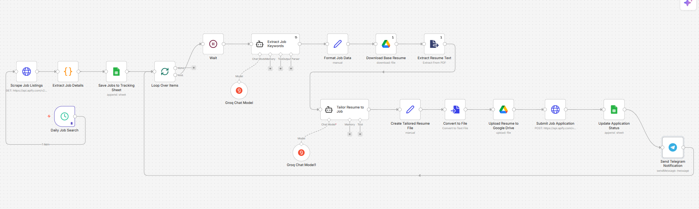

# 🤖 Automated Job Application System

<div align="center">


**An intelligent n8n automation workflow that scrapes job listings, tailors your resume using AI, auto-applies to jobs, and notifies you via Telegram — fully on autopilot.**

[Features](#-features) • [Workflow Overview](#-workflow-overview) • [Setup](#️-setup--installation) • [Configuration](#-configuration) • [Usage](#-usage)

</div>

---

## 📌 About

This project is a fully automated job application pipeline built using **n8n** (no-code workflow automation) and powered by **Groq AI**. It runs on a daily schedule, scrapes fresh job listings, uses AI to extract keywords and tailor your resume for each specific job, uploads the customized resume to Google Drive, submits the application, and sends you a Telegram notification — all without lifting a finger.

> ⚡ Built for job seekers who want to apply smarter, faster, and at scale.

---

## ✨ Features

- 🔍 **Daily Job Scraping** — Automatically scrapes job listings from job portals using Apify
- 🧠 **AI-Powered Keyword Extraction** — Uses Groq LLM to extract relevant keywords from each job description
- 📄 **Smart Resume Tailoring** — Dynamically customizes your base resume to match each job's requirements
- ☁️ **Google Drive Integration** — Uploads tailored resumes to your Drive automatically
- 📤 **Auto Job Application** — Submits applications via API without manual effort
- 📊 **Google Sheets Tracking** — Logs all job applications and statuses in a tracking sheet
- 📬 **Telegram Notifications** — Sends real-time updates on application status to your Telegram
- 🔁 **Loop Processing** — Handles multiple job listings in a single automated run

---

## 🔄 Workflow Overview

The automation follows this step-by-step pipeline:

```
Daily Trigger
     │
     ▼
Scrape Job Listings (Apify API)
     │
     ▼
Extract Job Details
     │
     ▼
Save to Google Sheets (Tracking Sheet)
     │
     ▼
Loop Over Each Job
     │
     ├──► Wait (Rate Limiting)
     │
     ├──► Extract Job Keywords (Groq AI + Output Parser)
     │
     ├──► Format Job Data
     │
     ├──► Download Base Resume (PDF)
     │
     ├──► Extract Resume Text (PDF Parser)
     │
     ├──► Tailor Resume to Job (Groq AI + Memory)
     │
     ├──► Create Tailored Resume File
     │
     ├──► Convert to File Format
     │
     ├──► Upload Resume to Google Drive
     │
     ├──► Submit Job Application (Apify API)
     │
     └──► Update Application Status (Google Sheets)
          │
          ▼
     Send Telegram Notification ✅
```

---

## 🛠️ Tech Stack

| Component | Technology |
|-----------|------------|
| **Workflow Automation** | [n8n](https://n8n.io) |
| **AI / LLM** | [Groq](https://groq.com) (LLaMA / Mixtral) |
| **Job Scraping** | [Apify](https://apify.com) |
| **Resume Storage** | Google Drive |
| **Job Tracking** | Google Sheets |
| **Notifications** | Telegram Bot |
| **Resume Format** | PDF → Text |

---

## ⚙️ Setup & Installation

### Prerequisites

Make sure you have the following before starting:

- ✅ [n8n](https://n8n.io) installed (self-hosted or cloud)
- ✅ [Groq API Key](https://console.groq.com)
- ✅ [Apify Account](https://apify.com) with API token
- ✅ Google Account (Drive + Sheets access)
- ✅ Telegram Bot Token (from [@BotFather](https://t.me/botfather))

### Step 1: Clone this Repository

```bash
git clone https://github.com/YOUR_USERNAME/automated-job-application-system.git
cd automated-job-application-system
```

### Step 2: Import Workflow into n8n

1. Open your **n8n dashboard**
2. Click **"Import from file"**
3. Select the `workflow.json` file from this repo
4. Click **Import**

### Step 3: Set Up Credentials

In n8n, add the following credentials:

| Credential | Where to Find |
|------------|---------------|
| **Groq API Key** | [console.groq.com](https://console.groq.com) |
| **Apify API Token** | Apify Dashboard → Settings → Integrations |
| **Google OAuth2** | Google Cloud Console |
| **Telegram Bot Token** | [@BotFather](https://t.me/botfather) on Telegram |

---

## 🔧 Configuration

### 1. Upload Your Base Resume
- Upload your base resume (PDF format) to Google Drive
- Copy the **file ID** from the Drive link
- Paste it in the **"Download Base Resume"** node in n8n

### 2. Set Up Google Sheets Tracking
Create a Google Sheet with these columns:

| Column | Description |
|--------|-------------|
| `Job Title` | Position name |
| `Company` | Company name |
| `Job URL` | Application link |
| `Status` | Applied / Pending / Rejected |
| `Applied Date` | Date of application |

### 3. Configure Job Search Parameters
In the **"Scrape Job Listings"** node, update:
- `keywords` — Job title you're targeting (e.g., `"Python Developer"`)
- `location` — Target location (e.g., `"Bangalore"`)
- `max_results` — Number of jobs per run (recommended: `10–20`)

### 4. Set Telegram Chat ID
- Start a chat with your Telegram bot
- Get your Chat ID from [@userinfobot](https://t.me/userinfobot)
- Add it to the **"Send Telegram Notification"** node

---

## 🚀 Usage

### Run Manually
1. Open the workflow in n8n
2. Click **"Execute Workflow"**
3. Watch the automation run in real-time!

### Schedule Daily Runs
The **Daily Job Search** trigger is configured to run automatically. To change the schedule:
1. Click the **"Daily Job Search"** node
2. Set your preferred cron schedule (e.g., every morning at 9 AM)

### Monitor Applications
- Open your **Google Sheet** to see all tracked applications
- Check **Telegram** for real-time notifications
- View execution history in n8n under the **"Executions"** tab

---

## 📁 Project Structure

```
automated-job-application-system/
├── 📄 workflow.json          # Main n8n workflow file (import this)
├── 📄 README.md              # Project documentation
├── 📁 docs/
│   ├── setup-guide.md        # Detailed setup instructions
│   └── screenshots/          # Workflow screenshots
├── 📁 templates/
│   └── resume-template.txt   # Resume prompt template for AI
└── 📄 LICENSE
```

---

## 📸 Workflow Screenshot



---

## 🔒 Environment Variables / Secrets

> ⚠️ **Never commit API keys to GitHub!**

All sensitive credentials are stored securely inside **n8n's Credential Manager**. No `.env` file is needed. Ensure your n8n instance is secured with authentication.

---

## 🤝 Contributing

Contributions are welcome! Here's how:

1. Fork the repo
2. Create a feature branch: `git checkout -b feature/your-feature`
3. Commit your changes: `git commit -m "✨ feat: add new feature"`
4. Push to the branch: `git push origin feature/your-feature`
5. Open a Pull Request

### Ideas for Contribution
- [ ] Support for LinkedIn Easy Apply
- [ ] Cover letter generation using AI
- [ ] Multi-language resume support
- [ ] Email notification support
- [ ] Dashboard for application analytics

---

## ⚠️ Disclaimer

This tool is intended for **personal use** to streamline the job application process. Please ensure your usage complies with the terms of service of any job platforms you target. The author is not responsible for any misuse.

---

## 📄 License

This project is licensed under the **MIT License** — see the [LICENSE](LICENSE) file for details.

---

## 🙋 Author

Made with ❤️ by **[Your Name]**

[](https://github.com/YOUR_USERNAME)
[](https://linkedin.com/in/YOUR_PROFILE)

---

<div align="center">

⭐ **If this project helped you, please give it a star!** ⭐

</div>
